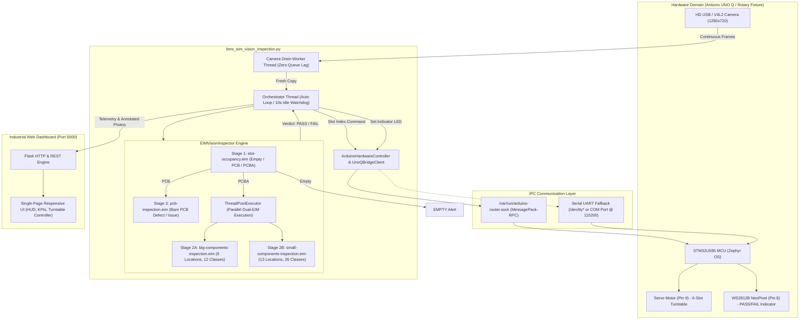

# BMS Vision Inspection — Pure Edge Impulse (.EIM) AOI System

An industrial-grade, photo-level **Automated Optical Inspection (AOI)** system designed for Battery Management System (BMS) PCB/PCBA manufacturing quality control. 

Engineered specifically for the **Arduino UNO Q** (dual-domain architecture with Qualcomm QRB2210 Linux MPU + STM32U585 Zephyr MCU) and edge Linux SBCs, running **strictly on compiled Edge Impulse (`.eim`) binaries with zero ONNX Runtime dependency**.

---

## 📑 Table of Contents
1. [System Architecture Overview](#system-architecture-overview)
2. [How `bms_eim_vision_inspection.py` Works](#how-bms_eim_vision_inspectionpy-works)
   - [1. Pure Native .EIM Execution Engine](#1-pure-native-eim-execution-engine)
   - [2. Fit-Longest Aspect-Ratio Preserving Preprocessing](#2-fit-longest-aspect-ratio-preserving-preprocessing)
   - [3. Multi-Stage Conditional Vision Pipeline](#3-multi-stage-conditional-vision-pipeline)
   - [4. Dual-Domain Arduino Hardware Controller](#4-dual-domain-arduino-hardware-controller)
   - [5. Zero-Lag Camera Draining Worker](#5-zero-lag-camera-draining-worker)
   - [6. Orchestration & Operating Modes (Auto vs Manual)](#6-orchestration--operating-modes-auto-vs-manual)
   - [7. Modern Industrial Web Dashboard & REST API](#7-modern-industrial-web-dashboard--rest-api)
3. [Component Matrix & Model Taxonomy](#component-matrix--model-taxonomy)
4. [Hardware Wiring & Turntable Specifications](#hardware-wiring--turntable-specifications)
5. [Directory Layout](#directory-layout)
6. [Installation & Requirements](#installation--requirements)
7. [Running the Application](#running-the-application)
8. [REST API Reference](#rest-api-reference)
9. [Troubleshooting & Diagnostics](#troubleshooting--diagnostics)

---

## 🏛️ System Architecture Overview



---

## ⚙️ How `bms_eim_vision_inspection.py` Works

The script is structured into modular, decoupled subsystems that operate concurrently using Python threading, inter-process communication (IPC), and real-time computer vision.

### 1. Pure Native .EIM Execution Engine (`NativeEIMRunner`)
- **Zero ONNX Runtime**: Unlike standard inference scripts that require large runtimes like `onnxruntime` or `torch`, this script directly executes compiled Edge Impulse Linux executables (`.eim`).
- **Subprocess & Unix Domain Socket IPC**:
  - The script spawns each `.eim` binary as an independent child process (`subprocess.Popen([model_path, sock_path])`).
  - It opens a dedicated Unix domain socket (`runner.sock`) in a secure temporary folder and establishes full-duplex JSON IPC communication.
  - Upon initialization, the runner sends a `{"hello": 1}` handshake to acquire the model dimensions, input format, label lists, and channel count.
- **POSIX Shared Memory (Zero-Copy)**:
  - If POSIX shared memory is supported (`HAS_SHM=True`), the runner accesses the model's shared memory segment (`features_shm`) via `multiprocessing.shared_memory`.
  - Tensors are written directly into shared memory without socket serialisation overhead, achieving ultra-low inference latency on ARM Cortex-A53 cores.
- **Cross-Platform Host Simulation**:
  - When executed on non-Linux operating systems (e.g., Windows or macOS during development), `NativeEIMRunner` detects that ELF AArch64 binaries cannot run natively and seamlessly shifts into simulation mode (`is_mock=True`). This allows full testing of the web interface, camera pipeline, and UI without crashing.

---

### 2. Fit-Longest Aspect-Ratio Preserving Preprocessing (`resize_fit_longest`)
Peripheral SMD components and edge solder joints are prone to being cut off if images are stretched or center-cropped:
- **Uniform Scaling**: The image is uniformly scaled based on `scale = min(target_w / orig_w, target_h / orig_h)` so the longest axis fits the model input (e.g., 640×640) without any geometric distortion.
- **Symmetric Zero-Padding**: The remaining borders are padded symmetrically with black pixels (`value=[0, 0, 0]`), matching the exact *fit-longest* DSP pipeline configured during Edge Impulse model training.
- **Vectorized Pixel Packing**: For unquantized float32 Edge Impulse models, pixels are packed into 32-bit unsigned integers `((R << 16) | (G << 8) | B)` using high-performance NumPy vectorization.
- **Coordinate Unprojection**: After the `.eim` binary returns bounding boxes relative to the letterboxed canvas, `_run_detection_runner()` mathematically unprojects each bounding box `(bx, by, bw, bh)` back to the original full-resolution camera coordinate space:
  $$\text{x}_1 = \frac{\text{bx} - \text{left\_pad}}{\text{scale}}, \quad \text{y}_1 = \frac{\text{by} - \text{top\_pad}}{\text{scale}}$$

---

### 3. Multi-Stage Conditional Vision Pipeline (`EIMVisionInspector`)

Inspection proceeds through an intelligent decision tree:

```
[ Captured Frame (1280x720) ]
              │
              ▼
   [ Stage 1: slot-occupancy.eim ]
              │
     ┌────────┼────────┐
     │        │        │
  "Empty"   "PCB"    "PCBA"
     │        │        │
     │        │        ▼
     │        │   [ Parallel PCBA Inspection ]
     │        │   ├─ Stage 2A: big-components-inspection.eim (6 Major ICs/Passives)
     │        │   └─ Stage 2B: small-components-inspection.eim (13 SMD Passives & LEDs)
     │        │        │
     │        │        ▼
     │        │   [ Component State Resolution ]
     │        │   (Verify all 19 components are PRESENT)
     │        │        │
     │        │   ┌────┴────┐
     │        │  PASS     FAIL
     │        │
     │        ▼
     │   [ Stage 3: pcb-inspection.eim ]
     │   (Bare PCB defect inspection: scratches, shorts, copper voids)
     │        │
     │   ┌────┴────┐
     │  PASS (0)  FAIL (≥1)
     ▼
[ Operator Alert / NeoPixel LED Update (GREEN = PASS, RED = FAIL) ]
```

#### Decision Stages:
1. **Stage 1 — Slot Occupancy (`slot-occupancy.eim`)**:
   - Classifies fixture contents into `Empty`, `PCB`, or `PCBA`.
   - If `Empty`, inspection stops immediately, logging an `EMPTY` status and setting the indicator to alert.
2. **Stage 2 — Assembled PCBA Inspection (Dual-Model Parallel)**:
   - When `PCBA` is detected, the pipeline spawns a concurrent thread pool (`ThreadPoolExecutor(max_workers=2)`).
   - Simultaneously runs `big-components-inspection.eim` (6 major components) and `small-components-inspection.eim` (13 miniature SMD components).
   - **Candidate Resolution**: For every physical designator, candidate bounding boxes are parsed. If both present (`A`) and missing (`N`) detections occur, the one with higher confidence is selected.
   - **Verdict Logic**:
     - **PASS**: All 19 components are detected as `PRESENT`.
     - **FAIL**: Any of the 19 components is detected as `MISSING`.
     - **PARTIAL SCAN**: If one or more components are unrecognized or occluded.
3. **Stage 3 — Bare PCB Defect Inspection (`pcb-inspection.eim`)**:
   - Triggered when Stage 1 determines the board is unpopulated (`PCB`).
   - Scans for manufacturing defects such as solder bridges, trace scratches, or surface issues.
   - **PASS**: 0 defects detected.
   - **FAIL**: $\ge 1$ defect detected.

---

### 4. Dual-Domain Arduino Hardware Controller (`ArduinoHardwareController`)

The hardware controller provides unified hardware control across multiple hardware configurations:

1. **Arduino UNO Q Direct Router Bridge (`UnoQBridgeClient`)**:
   - Communicates with the Linux-side router on the Arduino UNO Q via `/var/run/arduino-router.sock`.
   - Uses a pure Python standard-library implementation of **MessagePack-RPC notifications** (`_pack_notify`) to dispatch RPC commands directly to the STM32U585 MCU without third-party dependencies.
2. **Standard Serial UART Fallback**:
   - If running on a PC connected to a standard Arduino over USB or serial port (e.g., `COM3` or `/dev/ttyACM0`), it uses PySerial at 115200 baud.
   - Commands: `<slot_id>\n` to move servo, `P\n` for PASS (Green), `F\n` for FAIL (Red).
3. **Virtual Simulation Fallback**:
   - If no hardware is detected or if `--serial-port none` is passed, runs safely in simulation without throwing exceptions.
4. **Distance-Adaptive Travel & Motion-Blur Damping**:
   - Rotary table movement time adapts to the angular distance between slots:
     $$\text{travel\_time} = 
     \begin{cases} 
     0.40\,\text{s} & \text{if } \text{dist} = 0 \\ 
     0.82\,\text{s} & \text{if } \text{dist} = 1 \\ 
     0.82 + (\text{dist} - 1) \times 0.28\,\text{s} & \text{if } \text{dist} > 1 
     \end{cases}$$
   - Includes an additional **`0.22s` settling damping delay** after the servo arrives to ensure mechanical vibrations cease before capturing the photo.

---

### 5. Zero-Lag Camera Draining Worker (`_camera_worker`)
- Standard OpenCV `VideoCapture.read()` calls buffer frames in driver memory (V4L2 on Linux, DirectShow on Windows).
- A dedicated background thread continuously drains incoming frames at maximum camera frame rate into `self.latest_frame`.
- When an inspection occurs, `_capture_photo()` retrieves a fresh, unbuffered snapshot immediately after turntable stabilization, completely eliminating stale buffer frames.

---

### 6. Orchestration & Operating Modes (`_orchestrator_loop`)
- **AUTO Mode**: Automatically indexes through slots $1 \rightarrow 2 \rightarrow 3 \rightarrow 4 \rightarrow 5 \rightarrow 6$ sequentially, pauses for stabilization, runs the vision inspection, updates hardware LEDs, and waits 1.8 seconds before indexing the next nest.
- **MANUAL Mode**: Operators can click any slot (1–6) on the web dashboard to instantly index and inspect that specific nest.
- **10-Second Idle Watchdog (`AUTO_IDLE_TIMEOUT`)**: If the system remains in `MANUAL` mode without operator interaction for 10 seconds, the watchdog automatically returns the system to continuous `AUTO` loop mode.

---

### 7. Modern Industrial Web Dashboard & REST API
- Built-in Flask HTTP server serving a modern, responsive single-page dashboard.
- Live inspection viewport displaying 1280×720 annotated photos with color-coded bounding boxes (Green for Available, Red for Missing/Defects, Amber for warnings).
- Real-time KPIs: Cycle latency, slot occupancy classification, confidence rating, and surface state.
- Interactive turntable controls with live thumbnail history for each of the 6 slots.
- Hardware manual diagnostic controls to test individual servo positions (1–6) and toggle PASS/FAIL LEDs.
- Sensitivity threshold slider and center reticle ROI toggle.

---

## 🔍 Component Matrix & Model Taxonomy

### 1. Stage 1: Slot Occupancy (`slot-occupancy.eim`)
| Label | Description | Next Pipeline Action |
| :--- | :--- | :--- |
| `Empty` | Fixture nest is unoccupied | Log `EMPTY`, illuminate Amber/Red LED |
| `PCB` | Bare, unpopulated printed circuit board | Route to Stage 3 Bare PCB Defect Inspection |
| `PCBA` | Fully populated printed circuit board assembly | Route to Stage 2 Dual-Model PCBA Inspection |

### 2. Stage 2A: Major Components (`big-components-inspection.eim`)
Contains 12 trained classes across 6 critical physical locations:
| Component Key | Component Name | Available Label | Missing Label |
| :---: | :--- | :---: | :---: |
| **S** | Slide Switch / Socket | `SA` | `SN` |
| **U** | USB-C Receptacle / Main IC | `UA` | `UN` |
| **C1** | Large Bulk Capacitor 1 | `C1A` | `C1N` |
| **I** | Power Inductor | `IA` | `IN` |
| **P** | Power Management IC / Port | `PA` | `PN` |
| **C2** | Large Bulk Capacitor 2 | `C2A` | `C2N` |

### 3. Stage 2B: SMD Passives & LEDs (`small-components-inspection.eim`)
Contains 26 trained classes across 13 miniature component locations:
| Designator Group | Locations | Available Classes (`A`) | Missing Classes (`N`) |
| :--- | :--- | :--- | :--- |
| **SMD Capacitors** | C1, C2, C3, C4, C5, C6, C7 | `C1A` – `C7A` | `C1N` – `C7N` |
| **Inductors / LEDs** | L1, L2 | `L1A`, `L2A` | `L1N`, `L2N` |
| **SMD Resistors** | R1, R3, R4, R5 | `R1A`, `R3A`, `R4A`, `R5A` | `R1N`, `R3N`, `R4N`, `R5N` |

### 4. Stage 3: Bare PCB Defect Inspection (`pcb-inspection.eim`)
| Class | Evaluation Rule |
| :--- | :--- |
| `Issue` | **0 Detections** = `PASS` (Clean board surface)<br>**$\ge$ 1 Detection** = `FAIL` (Trace defect, scratch, bridge, or void) |

---

## 🔌 Hardware Wiring & Turntable Specifications

```
                     ┌───────────────────────────┐
                     │      ARDUINO UNO Q        │
                     │  (QRB2210 + STM32U585)    │
                     │                           │
                     │   [Pin 9] ─── PWM ───────►│─── Servo Motor Signal (Yellow/Orange)
                     │   [Pin 8] ─── DIN ───────►│─── WS2812B NeoPixel DIN (Green)
                     │   [5V]    ─── VCC ───────►│─── Logic Power
                     │   [GND]   ─── GND ───────►│─── Common Ground
                     └───────────────────────────┘
```

> [!IMPORTANT]
> When operating high-torque servos, power the servo motor via an **external dedicated 5V 2A power supply**, tying external GND to Arduino GND.

### Turntable Calibrated Servo Pulses
| Slot ID | Turntable Angle | Microseconds ($\mu\text{s}$) |
| :---: | :---: | :---: |
| **Slot 1** | 0° | `500 µs` |
| **Slot 2** | 60° | `930 µs` |
| **Slot 3** | 120° | `1360 µs` |
| **Slot 4** | 180° | `1790 µs` |
| **Slot 5** | 240° | `2220 µs` |
| **Slot 6** | 300° | `2650 µs` |

---

## 📂 Directory Layout

```
BMS EIM Vision Inspection/
├── bms_eim_vision_inspection.py   # Main inspection engine, hardware controller, and dashboard
├── requirements.txt               # Lightweight runtime dependencies (Flask, OpenCV, NumPy, PySerial)
├── README.md                      # Comprehensive technical documentation
├── arduino_logo.jpg               # Branding asset for web dashboard
├── ei_logo.png                    # Edge Impulse branding asset for web dashboard
├── models/                        # Compiled Edge Impulse .eim executables
│   ├── slot-occupancy.eim         # Stage 1: Fixture occupancy classification
│   ├── big-components-inspection.eim   # Stage 2A: 6 major components
│   ├── small-components-inspection.eim # Stage 2B: 13 miniature SMD components
│   └── pcb-inspection.eim         # Stage 3: Bare PCB surface defect detection
├── arduino_firmware/              # Arduino / Zephyr MCU firmware
│   └── bms_servo_led/
│       ├── bms_servo_led.ino      # Dual-mode sketch (Bridge RPC & Serial fallback)
│       └── README.md              # Firmware flashing & architecture guide
└── snapshots/                     # Cached captures and verification frames
```

---

## 📦 Installation & Requirements

### Dependencies
The runtime strictly avoids heavy deep learning frameworks:
```
flask>=2.2.0
opencv-python-headless>=4.5.1.48
numpy>=1.20.0
pyserial>=3.5
```

### Install in Virtual Environment:
```bash
# Create and activate virtual environment
python -m venv .venv

# On Linux:
source .venv/bin/activate

# On Windows:
.venv\Scripts\activate

# Install dependencies
pip install -r requirements.txt
```

> [!TIP]
> On headless Linux SBCs (e.g. Arduino UNO Q), install `opencv-python-headless` instead of `opencv-python` to eliminate unnecessary X11/GUI library dependencies.

---

## 🚀 Running the Application

### 1. On Arduino UNO Q (Linux MPU):
```bash
# Make models executable
chmod +x models/*.eim

# Launch with default camera (0) and automatic UNO Q Bridge connection
python3 bms_eim_vision_inspection.py --source 0 --serial-port bridge
```

### 2. On Host PC / Testing Machine:
```bash
# Run with local USB webcam and simulation or serial port:
python bms_eim_vision_inspection.py --source 0 --serial-port auto
```

### Command-Line Arguments:
| Argument | Type | Default | Description |
| :--- | :---: | :---: | :--- |
| `--source` | `str` | `"0"` | Camera index (`"0"`, `"1"`), video path (`.mp4`), or image path |
| `--serial-port`| `str` | `"auto"` | Hardware port (`"bridge"`, `"auto"`, `"/dev/ttyACM0"`, `"COM3"`, `"none"`) |
| `--baud` | `int` | `115200` | Baud rate for serial UART |
| `--port` | `int` | `5000` | HTTP port for web dashboard |
| `--host` | `str` | `"0.0.0.0"`| Host interface binding (`0.0.0.0` allows LAN access) |
| `--conf` | `float`| `0.20` | Detection confidence cutoff for PCBA components (0.10 to 0.90) |
| `--pcb-conf` | `float`| `0.60` | Defect confidence cutoff for bare PCB issues |
| `--use-roi` | `flag` | `True` | Restricts defect analysis to center reticle area |
| `--full-frame` | `flag` | — | Disables reticle filtering and inspects full field-of-view |

Open your web browser and navigate to:
```
http://localhost:5000
```
*(Or `http://<device-ip>:5000` from any device on your local network).*

---

## 🌐 REST API Reference

The embedded Flask server exposes real-time endpoints for machine-to-machine integration and factory automation:

| Endpoint | Method | Description | Payload / Response |
| :--- | :---: | :--- | :--- |
| `/` | `GET` | Serves the web dashboard single-page interface | HTML |
| `/api/status` | `GET` | Current system telemetry, active slot, and all slot statuses | JSON |
| `/api/slot_photo/<int:slot_id>` | `GET` | Fetches the latest annotated JPEG photo for a specific slot | `image/jpeg` |
| `/api/select_slot/<int:slot_id>` | `POST` | Manually commands turntable to index and inspect a slot | `{"success": true, "slot": {...}}` |
| `/api/toggle_mode` | `POST` | Toggles between `AUTO` loop and `MANUAL` mode | `{"success": true, "mode": "AUTO"}` |
| `/api/hardware/ports` | `GET` | Scans and lists all available serial and bridge ports | `{"ports": [...]}` |
| `/api/hardware/connect` | `POST` | Connects or reconnects to a specified port | `{"port": "COM3", "baud": 115200}` |
| `/api/hardware/test_servo/<int:slot_id>` | `POST` | Diagnostic command to pulse servo to slot position | `{"success": true, "slot": 2}` |
| `/api/hardware/test_led/<color>` | `POST` | Diagnostic command to set NeoPixel LED (`PASS` or `FAIL`) | `{"success": true, "color": "PASS"}` |
| `/api/config/sensitivity` | `POST` | Updates AI confidence cutoff and reticle ROI filtering | `{"conf": 0.25, "use_roi": true}` |

---

## 🛠️ Troubleshooting & Diagnostics

- **OpenCV VideoCapture missing**:
  - If you encounter errors mentioning `has no VideoCapture`, an empty dummy package named `cv2` was installed from PyPI. Fix by running:
    ```bash
    pip uninstall -y cv2 opencv-python opencv-python-headless
    pip install --no-cache-dir opencv-python-headless
    ```
- **Permission denied executing `.eim`**:
  - Run `chmod +x models/*.eim` to grant execution permissions to the binaries on Linux.
- **Turntable jitter or brownout**:
  - Servos drawing sudden inrush current can drop the 5V rail on small SBCs. Ensure the servo is supplied by an external 5V 2A DC supply with shared ground.
- **Motion blur during image capture**:
  - The script enforces an adaptive travel delay and a `0.22s` settling damping pause. If your turntable has significant mass, adjust the settle pause in `inspect_slot()` or tune mechanical damping.
