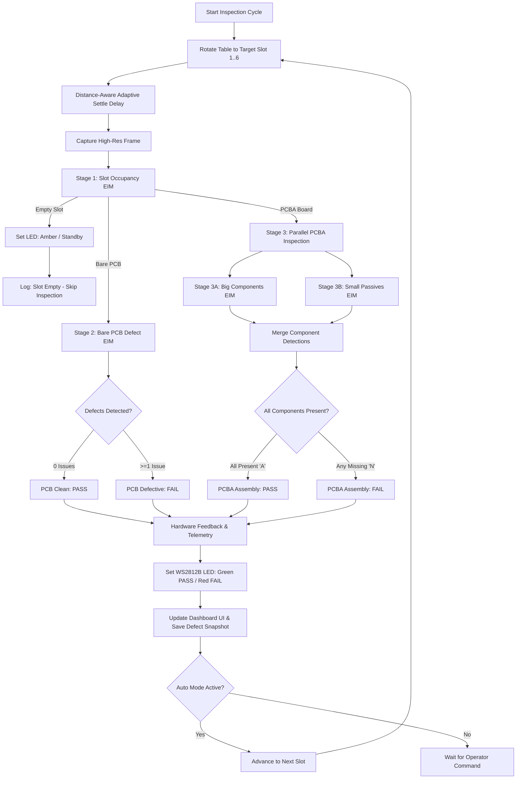

# Edge AI Vision Inspection System
### Automated Optical Inspection (AOI) for Battery Management System (BMS) PCB & PCBA Manufacturing

An industrial-grade, multi-stage Automated Optical Inspection (AOI) platform engineered for electronics manufacturing lines. The system automates quality control on a 6-slot indexing rotary turntable, executing real-time defect detection, assembly verification, and bare PCB surface inspection using edge-optimized AI models.

Designed for edge deployment on the **Arduino UNO Q (Qualcomm QRB2210 Linux MPU + STM32U585 Zephyr MCU)** as well as standard Linux AArch64 / x86 SBCs and Windows workstations.

> 📖 **Project Story & Step-by-Step Build Tutorial:**
> Looking for the complete build walkthrough, 3D printing guide, Edge Impulse BYOM workflow, and step-by-step setup? Read the **[Project Guide & Build Tutorial](file:///c:/Users/MAKERBRAINS/Downloads/Edge%20Ai%20Vision%20Inspection/PROJECT_GUIDE.md)**!

---

## 📑 Table of Contents

- [System Overview](#-system-overview)
- [Repository Structure](#-repository-structure)
- [End-to-End Inspection Pipeline](#-end-to-end-inspection-pipeline)
- [Deep Learning Models](#-deep-learning-models)
  - [1. Slot Occupancy Detection](#1-stage-1-slot-occupancy-detection)
  - [2. Bare PCB Defect Inspection](#2-stage-2-bare-pcb-defect-inspection)
  - [3. Big Components Inspection](#3-stage-3a-big-components-inspection)
  - [4. Small Components Inspection](#4-stage-3b-small-components-inspection)
- [Hardware Architecture & Rotary Table](#-hardware-architecture--rotary-table)
- [Production Runtime (BMS EIM Vision Inspection)](#-production-runtime-bms-eim-vision-inspection)
- [Model Training & Conversion Workflow](#-model-training--conversion-workflow)
- [Installation & Quickstart](#-installation--quickstart)
  - [Prerequisites](#prerequisites)
  - [Running on Host PC (Windows / Linux)](#running-on-host-pc-windows--linux)
  - [Running on Arduino UNO Q (Linux SBC)](#running-on-arduino-uno-q-linux-sbc)
- [Web Dashboard Features](#-web-dashboard-features)
- [License & Credits](#-license--credits)

---

## 🔭 System Overview

```
                      ┌──────────────────────────────────────────────┐
                      │             Industrial Camera / USB          │
                      └──────────────────────┬───────────────────────┘
                                             │ Video Stream (RGB)
                                             ▼
┌────────────────────────────────────────────────────────────────────────────────────────┐
│                        Edge Processing Unit (Arduino UNO Q / Host PC)                  │
│                                                                                        │
│   ┌────────────────────────────────────────────────────────────────────────────────┐   │
│   │                      Flask Web Dashboard & AOI Controller                      │   │
│   └──────┬──────────────────────────────────────────────────────────────────┬──────┘   │
│          │                                                                  │          │
│          ▼ Image Frames                                                     ▼ Commands │
│   ┌─────────────────────────────────────────┐               ┌──────────────────────┐   │
│   │   Pure Native .EIM Model Inference Engine│              │  Hardware Interface  │   │
│   │   (ARM NEON SIMD / Shared Memory IPC)   │              │  (Bridge RPC / UART) │   │
│   │                                         │              └──────────┬───────────┘   │
│   │   1. Slot Occupancy (Empty/PCB/PCBA)    │                         │               │
│   │   2. Bare PCB Defects (Scratches/Bridges│                         │               │
│   │   3. Big Components (6 Parts - 12 Cls)  │                         │               │
│   │   4. Small Passives (13 Parts - 26 Cls) │                         │               │
│   └─────────────────────────────────────────┘                         │               │
└───────────────────────────────────────────────────────────────────────┼────────────────┘
                                                                        │
                                   ┌────────────────────────────────────┴────────────────┐
                                   │ STM32U585 MCU / Arduino Microcontroller Firmware    │
                                   └──────────────┬──────────────────────────┬───────────┘
                                                  │ PWM Pulse Stream         │ Single-Wire Data
                                                  ▼                          ▼
                                      ┌──────────────────────┐   ┌──────────────────────┐
                                      │ 6-Slot Rotary Table  │   │ WS2812B NeoPixel LED │
                                      │   (Servo Actuator)   │   │  (PASS/FAIL/STATUS)  │
                                      └──────────────────────┘   └──────────────────────┘
```

The system inspects printed circuit boards at each step of the manufacturing lifecycle:
1. **Verifies fixture occupancy** before initiating camera capture.
2. **Routes bare boards** to surface defect verification (solder bridges, scratches, copper oxidation, breaks).
3. **Routes assembled boards** to dual-model component verification, confirming both large functional units and miniature SMD passive elements are soldered correctly and none are missing.
4. **Physically indexes the turntable** through 6 inspection slots and drives visual pass/fail feedback LEDs synchronously.

---

## 📂 Repository Structure

The repository is modularly organized into training pipelines, edge runtime, and microcontroller firmware:

```
Edge Ai Vision Inspection/
├── BMS EIM Vision Inspection/          # Production Runtime & Operator Dashboard
│   ├── arduino_firmware/               # Microcontroller firmware for rotary & LED control
│   │   └── bms_servo_led/
│   │       ├── bms_servo_led.ino       # Non-blocking PWM & WS2812B controller sketch
│   │       └── README.md               # Detailed firmware documentation & hardware guide
│   ├── models/                         # Standalone compiled Edge Impulse (.eim) binaries
│   │   ├── slot-occupancy.eim          # Stage 1: Empty / PCB / PCBA classifier
│   │   ├── pcb-inspection.eim          # Stage 2: Bare PCB defect detection
│   │   ├── big-components-inspection.eim # Stage 3A: Large IC & connector verification
│   │   └── small-components-inspection.eim # Stage 3B: SMD passives verification
│   ├── snapshots/                      # Auto-saved defect and inspection image captures
│   ├── bms_eim_vision_inspection.py    # Main Flask server, camera pipeline, EIM runner
│   ├── requirements.txt                # Lightweight Python dependencies (no ONNX runtime)
│   ├── run_app.bat                     # Windows one-click launcher
│   ├── run_app.sh                      # Linux / Arduino UNO Q launcher
│   └── README.md                       # EIM deployment-specific guide
│
├── Slot Occuppancy Detection/          # Stage 1 Dataset & Model Training
│   ├── dataset/                        # Image data classified into Empty, PCB, PCBA
│   ├── labels_makesense_classification.csv # Raw annotations
│   ├── webcam_inspect.py               # Live camera testing script
│   └── TRAINING_STEPS.md               # Step-by-step training documentation
│
├── PCB Inspection/                     # Stage 2 Dataset & Model Training
│   ├── yolo_dataset/                   # Train/val/test splits with defect annotations
│   ├── data.yaml                       # YOLO dataset descriptor
│   ├── labels_makesense.csv            # Defect bounding boxes
│   ├── webcam_inspect.py               # Live camera testing script
│   └── TRAINING_STEPS.md               # Defect model training documentation
│
├── Big Components Inspection/          # Stage 3A Dataset & Model Training
│   ├── dataset/                        # Raw labeled images
│   ├── yolo_dataset/                   # Normalized YOLO bounding boxes
│   ├── train.py                        # YOLO training pipeline
│   ├── export_onnx.py                  # ONNX export script
│   ├── generate_representative_features.py # Quantization feature extractor
│   ├── predict.py / webcam_inspect.py  # Model validation & live camera inspection
│   └── TRAINING_STEPS.md               # Comprehensive YOLO training documentation
│
└── Small Componets Inspection/         # Stage 3B Dataset & Model Training
    ├── dataset/                        # Raw images with SMD passives
    ├── yolo_dataset/                   # Train/val splits with 26 classes
    ├── data.yaml                       # YOLO dataset descriptor
    ├── labels_makesense.csv            # Passive component bounding boxes
    ├── webcam_inspect.py               # Live camera testing script
    └── TRAINING_STEPS.md               # SMD passive model training documentation
```

---

## 🔄 End-to-End Inspection Pipeline



---

## 🧠 Deep Learning Models

### 1. Stage 1: Slot Occupancy Detection
- **Model File:** `slot-occupancy.eim`
- **Inference Task:** Image Classification
- **Classes:** `Empty`, `PCB`, `PCBA`
- **Logic:**
  - `Empty`: Skips component analysis; keeps conveyor/turntable moving or warns operator.
  - `PCB`: Automatically branches execution to bare-board defect inspection.
  - `PCBA`: Automatically branches execution to component placement verification.

### 2. Stage 2: Bare PCB Defect Inspection
- **Model File:** `pcb-inspection.eim`
- **Inference Task:** Object Detection
- **Classes:** `Issue` (scratch, solder bridge, open circuit, oxidation, trace defect)
- **Quality Rule:**
  $$\text{Defect Count} = 0 \implies \mathbf{PASS} \quad \Big| \quad \text{Defect Count} \ge 1 \implies \mathbf{FAIL}$$

### 3. Stage 3A: Big Components Inspection
- **Model File:** `big-components-inspection.eim`
- **Inference Task:** Object Detection
- **Classes (12):** `C1A`, `C1N`, `C2A`, `C2N`, `IA`, `IN`, `PA`, `PN`, `SA`, `SN`, `UA`, `UN`
- **Physical Components Checked:**
  - `S` : Main Switch / Mode Selector Socket (Top-Left)
  - `U` : Primary Controller IC / USB-C Interface (Top-Right)
  - `C1`: Bulk Electrolytic Capacitor 1 (Bottom-Left)
  - `I` : High-Current Power Inductor (Bottom Center-Left)
  - `P` : Battery Output Terminal / Power Port (Bottom Center-Right)
  - `C2`: Bulk Electrolytic Capacitor 2 (Bottom-Right)
- **Evaluation:** Evaluated as `A` (Available / Present) vs `N` (Absent / Missing). Any detected missing component (`*N`) or unverified component flags an immediate unit failure.

### 4. Stage 3B: Small Components Inspection
- **Model File:** `small-components-inspection.eim`
- **Inference Task:** Object Detection
- **Classes (26):**
  - **Capacitors (14 classes):** `C1A`, `C1N`, `C2A`, `C2N`, `C3A`, `C3N`, `C4A`, `C4N`, `C5A`, `C5N`, `C6A`, `C6N`, `C7A`, `C7N`
  - **Inductors / LEDs (4 classes):** `L1A`, `L1N`, `L2A`, `L2N`
  - **Resistors (8 classes):** `R1A`, `R1N`, `R3A`, `R3N`, `R4A`, `R4N`, `R5A`, `R5N`
- **Evaluation:** 13 physical component locations evaluated simultaneously. Guarantees 100% placement coverage for minute surface-mount passives.

---

## ⚙️ Hardware Architecture & Rotary Table

The physical workstation consists of a 6-position circular turntable driven by a heavy-duty servo motor and an overhead camera.

### Microcontroller Pin Assignments:

| Signal / Function | Microcontroller Pin | Destination / Component |
| :--- | :---: | :--- |
| **Servo PWM Signal** | **Pin 9** | Servo motor control line |
| **WS2812B NeoPixel Data** | **Pin 8** | Single-wire RGB indicator LED |
| **Logic Ground** | **GND** | Shared common ground |
| **5V Power** | **5V / External** | Dedicated 5V 2A power rail |

### Turntable Slot Position Calibration:

| Slot Number | Physical Angle | PWM Pulse Width | Target Description |
| :---: | :---: | :---: | :--- |
| **Slot 1** | $0^\circ$ | `480 - 500 µs` | Indexing Station / Home |
| **Slot 2** | $60^\circ$ | `930 - 940 µs` | Test Station 2 |
| **Slot 3** | $120^\circ$ | `1360 µs` | Test Station 3 |
| **Slot 4** | $180^\circ$ | `1780 - 1790 µs` | Test Station 4 |
| **Slot 5** | $240^\circ$ | `2220 µs` | Test Station 5 |
| **Slot 6** | $300^\circ$ | `2650 µs` | Test Station 6 |

### Anti-Blur Adaptive Settling Mechanism
Rotary turntables have rotational inertia. Capturing an image before the turntable has fully settled causes motion blur, degrading classification accuracy. 

The firmware implements **distance-aware adaptive pulse settling**:
- 1-slot step ($60^\circ$): Emits 45 pulses ($\sim 900\text{ ms}$).
- 5-slot full return (Slot 6 $\to$ Slot 1, $300^\circ$ reverse sweep): Emits 102 pulses ($\sim 2040\text{ ms}$).
- Python AOI orchestrator sleeps proportionally before triggering camera acquisition.

---

## ⚡ Production Runtime (BMS EIM Vision Inspection)

The deployment application in [`BMS EIM Vision Inspection`](file:///c:/Users/MAKERBRAINS/Downloads/Edge%20Ai%20Vision%20Inspection/BMS%20EIM%20Vision%20Inspection) features a zero-dependency architecture:

1. **Zero ONNX Runtime Dependency**:
   - Compiles models directly into standalone `.eim` ELF executables via Edge Impulse.
   - Saves hundreds of megabytes of memory and avoids fragile C++ runtime library incompatibilities on embedded Linux.
2. **Hardware SIMD Acceleration**:
   - Executes with native ARM NEON SIMD vector extensions on the QRB2210 Cortex-A53 cores.
3. **Aspect-Ratio Preserving Letterboxing ("Fit-Longest")**:
   - Scales the longest axis to model input dimensions and pads with zeros (`pad=0`), avoiding distortion so tiny SMD pads retain their true geometry.
4. **POSIX Shared Memory IPC**:
   - High-throughput zero-copy image transfer between Python and compiled `.eim` child processes using `multiprocessing.shared_memory`.
5. **Universal Hardware Communication**:
   - **Arduino UNO Q**: Connects natively over `/var/run/arduino-router.sock` MessagePack-RPC bridge.
   - **Serial UART**: Automatic fallback to USB-Serial at 115200 baud on standard Linux/Windows PCs.
   - **Virtual Simulator**: Built-in mock hardware layer for off-line UI and model testing without physical motors attached.

---

## 🛠️ Model Training & Conversion Workflow

Each inspection module (`Big Components Inspection`, `Small Componets Inspection`, `PCB Inspection`, `Slot Occuppancy Detection`) follows a structured pipeline:

```
[Raw Photos / Video Capture]
            │
            ▼
[MakeSense.ai Labeling] ──> Export annotations as CSV / YOLO TXT
            │
            ▼
[Dataset Conversion] ──> convert_makesense_to_yolo.py (Standardizes to YOLOv8/YOLO11 format)
            │
            ▼
[Dataset Integrity Check] ──> verify_dataset.py (Validates bounding box coordinates)
            │
            ▼
[Model Training] ──> train.py (YOLO11n / YOLOv8n object detection or classification)
            │
            ▼
[Validation & Verification] ──> predict.py / webcam_inspect.py
            │
            ▼
[Edge Impulse Ingestion] ──> Upload images & labels to Edge Impulse Studio
            │
            ▼
[Compile .EIM Executable] ──> Export as Linux ARM64 (AArch64) or x86_64 .eim binary
            │
            ▼
[Deploy to BMS EIM Runtime] ──> Place in 'BMS EIM Vision Inspection/models/'
```

---

## 🚀 Installation & Quickstart

### Prerequisites
- Python 3.10 - 3.12 (Recommended)
- USB Webcam or MIPI CSI Camera
- Arduino UNO Q or any standard Arduino board (with [`bms_servo_led.ino`](file:///c:/Users/MAKERBRAINS/Downloads/Edge%20Ai%20Vision%20Inspection/BMS%20EIM%20Vision%20Inspection/arduino_firmware/bms_servo_led/bms_servo_led.ino) flashed)

### Running on Host PC (Windows / Linux)

1. Open a terminal and navigate to the inspection directory:
   ```bash
   cd "BMS EIM Vision Inspection"
   ```

2. Install Python dependencies:
   ```bash
   pip install -r requirements.txt
   ```

3. Launch the application:
   - On Windows: Double-click `run_app.bat` or run:
     ```cmd
     python bms_eim_vision_inspection.py --source 0 --port COM3
     ```
   - On Linux:
     ```bash
     python3 bms_eim_vision_inspection.py --source 0 --port /dev/ttyACM0
     ```

4. Open your web browser to:
   ```
   http://localhost:5000
   ```

### Running on Arduino UNO Q (Linux SBC)

1. Connect to the Arduino UNO Q via SSH or terminal:
   ```bash
   cd "BMS EIM Vision Inspection"
   chmod +x models/*.eim run_app.sh
   ```

2. Start the production service:
   ```bash
   ./run_app.sh
   ```
   *(The script activates the virtual environment, configures the camera, and establishes communication via the internal Arduino Router Bridge.)*

3. Access the dashboard from any device on the local network at:
   ```
   http://<uno-q-ip-address>:5000
   ```

---

## 🖥️ Web Dashboard Features

- **Real-Time Video Stream**: Live 30 FPS video feed with customizable bounding box overlays, labels, and confidence thresholds.
- **Stage Progression Panel**: Instant visual status for Slot Occupancy, Bare PCB Defects, Big Components, and Small Passives.
- **Interactive Turntable Controls**: Manual single-click slot positioning (Slots 1 to 6) or automated continuous inspection cycle.
- **Live Pass/Fail Metrics**: Real-time counters tracking Total Inspected, Units Passed, Units Failed, and Yield Percentage.
- **Defect Snapshot Gallery**: Automatically records high-resolution timestamped image snapshots whenever an inspection defect is detected.
- **Hardware Telemetry**: Displays real-time communication link status (Bridge RPC, Serial UART, or Virtual Simulation).

---

## 📖 Further Documentation

- **Microcontroller Firmware & Wiring**: Refer to [Arduino Firmware README](file:///c:/Users/MAKERBRAINS/Downloads/Edge%20Ai%20Vision%20Inspection/BMS%20EIM%20Vision%20Inspection/arduino_firmware/bms_servo_led/README.md) for pinouts, non-blocking PWM details, serial protocol commands, and Bridge RPC setup.
- **Training Documentation**: Refer to the respective `TRAINING_STEPS.md` files in each inspection subfolder for dataset preparation and hyperparameter details.
